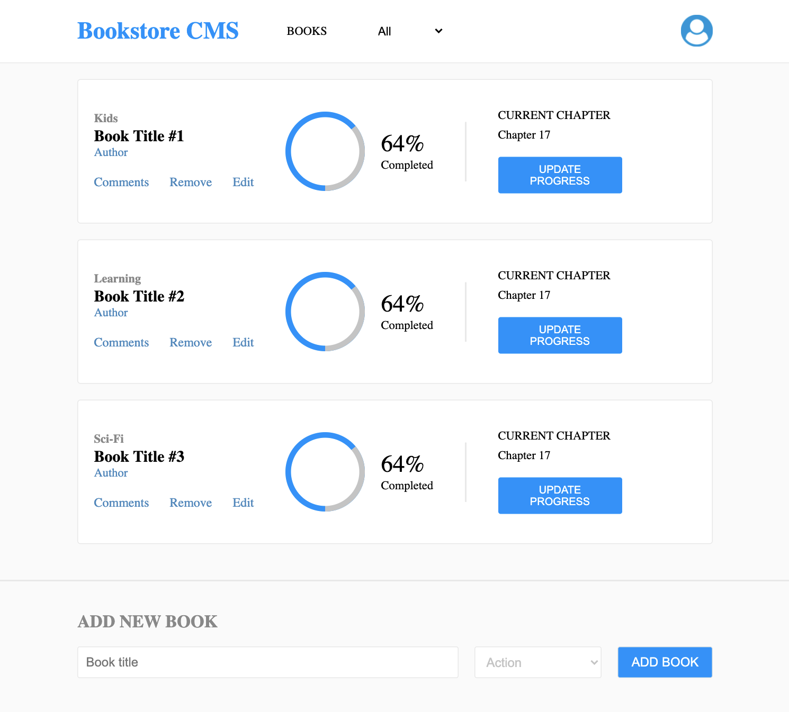

# REACT & REDUX BOOK-STORE

> A book-store application built using React and Redux and deployed to Heroku

## Watch the Live Version

[Live Demo](https://azamats-bookstore.herokuapp.com/)



### Built with

- JavaScript ES6
- React
- React-Redux
- Redux
- NodeJS
- Webpack
- Buildpack
- Heroku

### Features
- Filtering books by category
- Adding a new book
- Deleting a book

### Future features
- Progress monitoring
- Commenting
- Editing books
- UI enhancements

## Getting Started

In order to run locally this project type the following commands over the terminal in Linux or Mac or the Windows cmd console:

```s
$ git clone git@github.com:bettercallazamat/react-bookstore.git
$ cd react-bookstore
$ npm install
$ npm start

```

Open `http://localhost:3000` to view running project in the browser.

## Author

👤 **Azamat Nuriddinov**

- Github: [@bettercallazamat](https://github.com/bettercallazamat)
- Twitter: [@azamat_nuriddin](https://twitter.com/azamat_nuriddin)
- Linkedin: [Azamat Nuriddinov](https://www.linkedin.com/in/azamat-nuriddinov/)

## Acknowledgements
Thanks to @tiagobalmeida for [Circular Progress Bar With Plain HTML / CSS](https://github.com/tiagobalmeida/purecss-circular-progress-bar)

## 🤝 Contributing

Contributions, issues, and feature requests are welcome!

Feel free to check the [issues page](https://github.com/bettercallazamat/react-bookstore/issues).

## Show your support

Give a ⭐️ if you like this project!

## 📝 License

This project is [MIT](LICENSE) licensed.